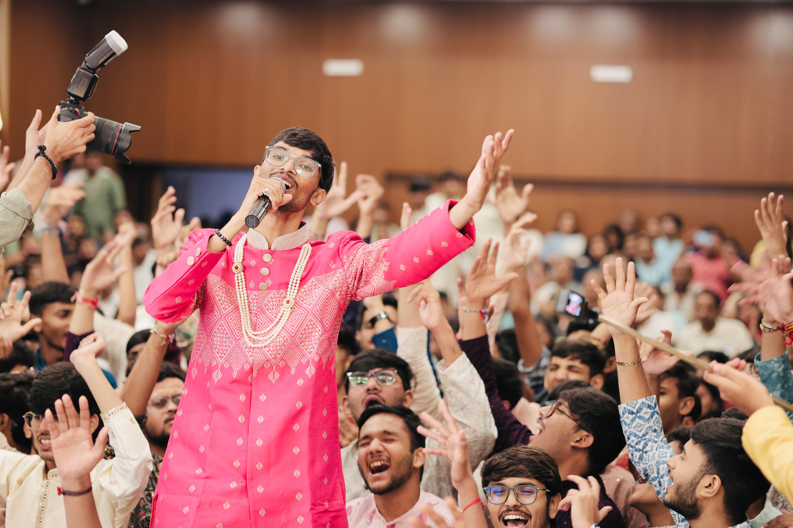

# 📱 RESPONSIVE TESTING GUIDE - Anahad by Shrey

## ✅ All Pages Are Now Responsive! (Including Images)

Your website is optimized for all devices with responsive images:
- ✓ Mobile (320px - 480px)
- ✓ Tablet (768px - 1024px)
- ✓ Desktop (1024px - 1440px)
- ✓ Large Desktop (1440px+)

---

## 🖼️ NEW: RESPONSIVE IMAGES IMPLEMENTATION

### What's New
✨ All images now automatically scale and adapt to every device:
- **Srcset Attributes** - Browsers download appropriately-sized images
- **Responsive CSS** - Images use `object-fit: cover` for perfect scaling
- **Lazy Loading** - Images load only when needed (performance boost)
- **Aspect Ratios** - Maintained across all screen sizes
- **Object Positioning** - Images centered beautifully on all devices

### Image Features by Breakpoint

| Breakpoint | Mobile (480px) | Tablet (768px) | Desktop (1024px) | Large (1440px+) |
|-----------|---|---|---|---|
| Hero Background | 250px height | 300px height | 400px height | 600px height |
| Gallery Images | Aspect 4:3 | Aspect 4:3 | Aspect 4:3 | Aspect 4:3 |
| Portrait Images | 100% width | 100% width | 50% width | 50% width |
| Card Images | 4:3 ratio | 4:3 ratio | 4:3 ratio | 4:3 ratio |
| Lightbox | 95vw max | 90vw max | 90vw max | 90vw max |

---

## 🚀 METHOD 1: Local Testing (Quickest)

### Windows:
1. Double-click `start-server.bat` in your project folder
2. Open browser: `http://localhost:8000`
3. Test all pages and resize browser to see responsive changes

### Mac/Linux:
```bash
cd ~/Desktop/Anahad_by_shrey_1
python3 -m http.server 8000
```
Then visit: `http://localhost:8000`

---

## 📱 METHOD 2: Test on Different Devices (Same WiFi)

1. Find your computer's IP address:
   ```bash
   ipconfig  # Windows
   ifconfig  # Mac/Linux
   ```
   Look for IPv4 Address (e.g., 192.168.1.100)

2. Start server (see Method 1)

3. On any device connected to same WiFi:
   - Phone: Visit `http://192.168.1.100:8000`
   - Tablet: Visit `http://192.168.1.100:8000`
   - Any device: Visit `http://[YOUR_IP]:8000`

---

## 🌐 METHOD 3: Chrome DevTools (Browser)

1. Open `index.html` in Chrome
2. Press `F12` to open DevTools
3. Click mobile icon (⌘+Shift+M on Mac)
4. Test on different devices:
   - iPhone SE
   - iPhone 12
   - iPhone 14 Pro Max
   - iPad
   - Android devices

---

## 📊 Responsive Breakpoints

| Device | Width | Status |
|--------|-------|--------|
| Small Mobile | 320px-480px | ✅ Optimized |
| Mobile | 480px-768px | ✅ Optimized |
| Tablet | 768px-1024px | ✅ Optimized |
| Desktop | 1024px-1440px | ✅ Optimized |
| Large Desktop | 1440px+ | ✅ Optimized |

---

## ✨ What's Responsive

- ✅ Navigation bar (hamburger menu on mobile)
- ✅ Hero section (scales perfectly)
- ✅ **Images** (adaptive sizing with srcset)
- ✅ **Hero Background** (height adjusts per device)
- ✅ **Gallery Images** (perfect aspect ratios)
- ✅ **Portrait Images** (responsive layout)
- ✅ **Card Sliders** (smooth scaling)
- ✅ **Lightbox Viewer** (fits all screens)
- ✅ Grid layouts (1 col → 2 col → 3 col → 4 col)
- ✅ Footer padding (icon spacing maintained)
- ✅ Floating icons (WhatsApp & scroll-to-top)
- ✅ Forms (full-width on mobile)
- ✅ Typography (fluid sizing with clamp())
- ✅ Modals & carousels
- ✅ All buttons & links

---

## 🔍 Testing Checklist

- [ ] Test hero image on mobile (250px height)
- [ ] Test hero image on tablet (300px height)
- [ ] Test hero image on desktop (400px height)
- [ ] Test hero image on large desktop (600px height)
- [ ] Test gallery images - verify aspect ratio 4:3
- [ ] Test portrait images - verify responsive width
- [ ] Test card sliders - verify scaling
- [ ] Test lightbox - verify max sizes
- [ ] Verify images use srcset for appropriate sizing
- [ ] Test lazy loading - images load on scroll
- [ ] Check object-fit: cover - images fill containers
- [ ] Verify object-position: center - images centered
- [ ] Test on mobile (smallest viewport)
- [ ] Test on tablet (medium viewport)
- [ ] Test on desktop (large viewport)
- [ ] Check footer icons positioning
- [ ] Verify text readability
- [ ] Test all navigation links
- [ ] Test contact form on mobile
- [ ] Check gallery responsiveness
- [ ] Verify carousel on different sizes
- [ ] Test performance

---

## 🎯 Pages to Test

1. **index.html** - Homepage with hero section
2. **about.html** - About page with timeline
3. **services.html** - Services/Pujas listing
4. **gallery.html** - Photo gallery
5. **contact.html** - Contact form

---

## 💡 Pro Tips

- Use Chrome DevTools for quick testing
- Test on actual devices for real-world experience
- Check both portrait and landscape modes
- Test with different network speeds
- Clear browser cache between tests
- **For Images**: Inspect element to see srcset and sizes attributes
- **For Performance**: Check Network tab to see responsive image loading

---

## 🖼️ RESPONSIVE IMAGES - Technical Details

### HTML Implementations

#### Hero Background Image
```html

```

#### Portrait Images
```html

```

### CSS Implementations

#### Hero Background - Responsive Heights
```css
/* Mobile - 250px */
@media (max-width: 480px) {
  .hero__bg-image {
    height: 250px;
    object-fit: cover;
  }
}

/* Tablet - 300px */
@media (max-width: 768px) {
  .hero__bg-image {
    height: 300px;
    object-fit: cover;
  }
}

/* Large Tablet - 400px */
@media (max-width: 1024px) {
  .hero__bg-image {
    height: 400px;
    object-fit: cover;
  }
}

/* Large Desktop - 600px */
@media (min-width: 1440px) {
  .hero__bg-image {
    height: 600px;
    object-fit: cover;
  }
}
```

### Key Features

1. **Srcset**: Multiple image sizes for different devices
   - 320w: Small mobile phones
   - 640w: Tablets and medium devices
   - 1280w: Desktop screens

2. **Sizes**: Tells browser which image size to use
   - Mobile (≤768px): 100% viewport width
   - Desktop (>768px): 50% viewport width

3. **Object-fit**: Ensures images scale perfectly
   - `cover`: Image fills container without distortion
   - `contain`: Entire image visible with white space

4. **Object-position**: Keeps images centered
   - `center`: Focuses on image center

5. **Lazy Loading**: Images load only when needed
   - `loading="lazy"`: Performance optimization

6. **Aspect Ratios**: Maintained across devices
   - 4:3 for gallery
   - 3:4 for portraits
   - 1:1 for cards

---

**All set! Your website is now fully responsive!** 🎉
